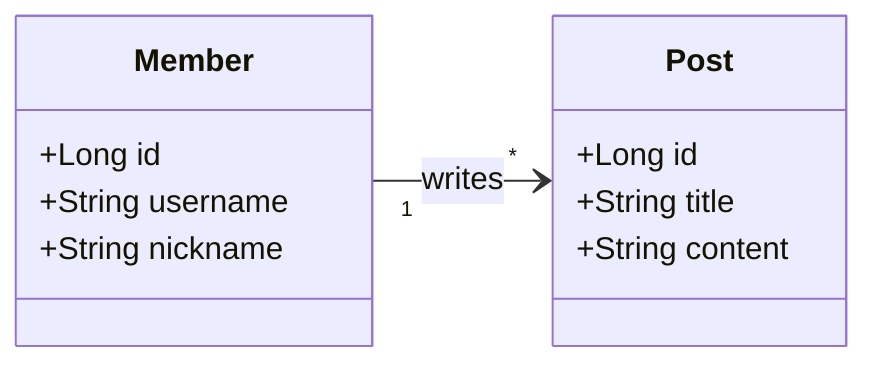
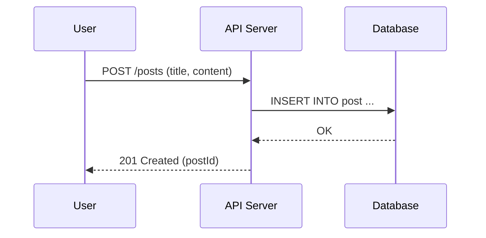

# 안녕하세요.

- 반갑습니다.
- 반가워요.

# uml 예시

## Class Diagram

```mermaid
classDiagram
direction LR

class Member {
  +Long id
  +String username
  +String nickname
}

class Post {
  +Long id
  +String title
  +String content
}

Member "1" --> "*" Post : writes
```

## Sequence Diagram

```mermaid
sequenceDiagram
participant U as User
participant API as API Server
participant DB as Database

U->>API: POST /posts (title, content)
API->>DB: INSERT INTO post ...
DB-->>API: OK
API-->>U: 201 Created (postId)
```
